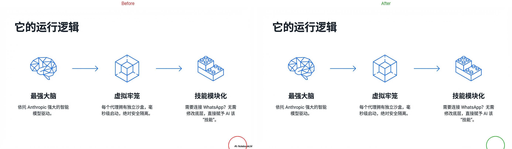

# notebooklm-dewatermark

Remove the NotebookLM watermark from exported PPTX slides.

NotebookLM adds a small "NotebookLM" logo + text watermark to the bottom-right corner of every slide it generates. This tool removes it cleanly, handling any background color (white, black, blue, gradients, textures).

## How it works

NotebookLM exports each slide as a single full-page PNG image embedded in a PPTX file. The watermark is baked into the image itself. This tool:

1. Detects full-page slide images (skips logos, icons, and inline images)
2. Checks if a watermark actually exists before processing
3. Samples background pixels above the watermark area
4. Pastes with feathered edges for seamless blending
5. Deduplicates shared images across slides
6. Saves a clean copy of the PPTX

## Install

```bash
git clone https://github.com/Longado/notebooklm-dewatermark.git
cd notebooklm-dewatermark
pip install -r requirements.txt
```

## Usage

```bash
# Single file
python3 notebooklm_dewatermark.py presentation.pptx

# Custom output name
python3 notebooklm_dewatermark.py presentation.pptx -o clean.pptx

# Batch processing
python3 notebooklm_dewatermark.py *.pptx

# Custom watermark dimensions (if NotebookLM changes the watermark size)
python3 notebooklm_dewatermark.py input.pptx --wm-width 200 --wm-height 40
```

Output files are named `<original>_clean.pptx` by default.

## Before / After



## Features

- Only processes full-page background images (won't touch logos or inline photos)
- Auto-detects whether a watermark is present (skips slides without one)
- Feathered edge blending for seamless removal on any background
- Handles shared images across slides (no double-processing)
- Customizable watermark dimensions via CLI flags
- Batch processing support

## Requirements

- Python 3.8+
- python-pptx
- Pillow

## License

MIT
